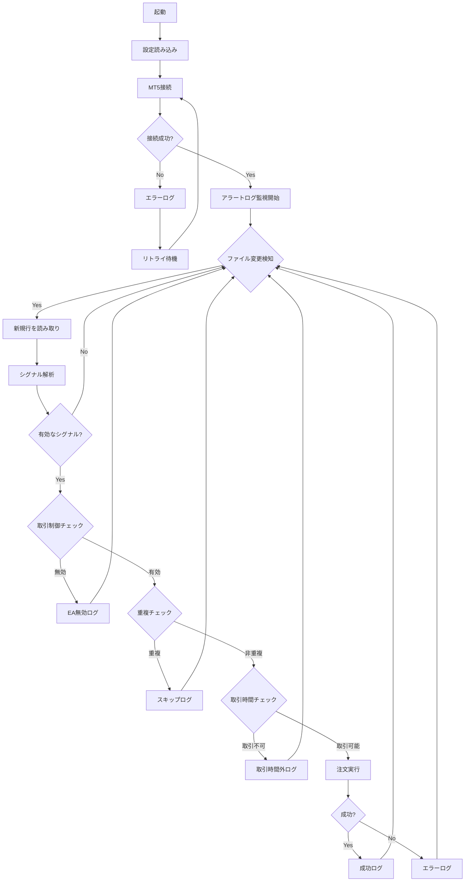
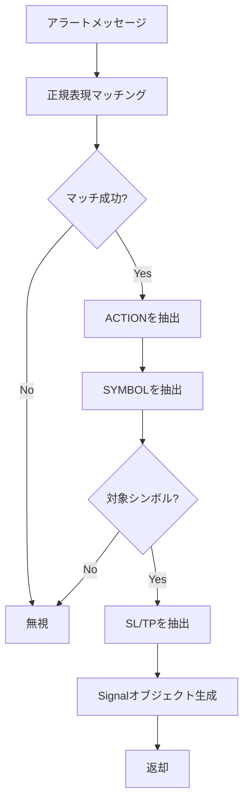

# MonitoringIndicator - システム仕様書

## 1. プロジェクト概要

### 1.1 目的
MT4カスタムインジケーターからのアラートシグナルを監視し、MT5（Vantage Trading）で自動注文を行うシステム。

### 1.2 システム構成図

```
┌─────────────────┐     ┌─────────────────────────────────────┐     ┌─────────────────┐
│     MT4         │     │         Python システム              │     │     MT5         │
│  ┌───────────┐  │     │  ┌─────────┐  ┌──────────────────┐  │     │  ┌───────────┐  │
│  │ カスタム   │  │     │  │ アラート │  │    シグナル      │  │     │  │  Vantage  │  │
│  │ インジ    │──┼────▶│  │ ログ    │──│    パーサー      │  │     │  │  Trading  │  │
│  │ ケーター  │  │     │  │ 監視    │  │    重複排除      │  │     │  │  口座     │  │
│  │ (ex4)    │  │     │  └─────────┘  └────────┬─────────┘  │     │  └─────┬─────┘  │
│  └───────────┘  │     │                        │            │     │        │        │
│        │        │     │  ┌─────────┐  ┌────────▼─────────┐  │     │        │        │
│        ▼        │     │  │ 操作    │  │    MT5注文       │──┼────▶│        │        │
│   アラート      │     │  │ ログ    │◀─│    モジュール    │  │     │        │        │
│   ログファイル   │     │  └─────────┘  └──────────────────┘  │     │        │        │
└─────────────────┘     └─────────────────────────────────────┘     └─────────────────┘
```

## 2. 機能要件

### 2.1 アラート監視機能

| 項目 | 仕様 |
|------|------|
| 監視対象 | MT4アラートログファイル |
| 監視方式 | ファイル変更検知（watchdog） |
| 検知遅延 | 1秒以内 |

**MT4アラートログの場所:**

```
C:\Users\{ユーザー名}\AppData\Roaming\MetaQuotes\Terminal\{32文字のID}\MQL4\Logs\YYYYMMDD.log
```

| パス要素 | 説明 |
|----------|------|
| `{ユーザー名}` | Windowsログインユーザー名 |
| `{32文字のID}` | MT4インストールごとの固有ID |
| `YYYYMMDD.log` | 日付ごとのログファイル（例: 20250116.log） |

**ログパスの確認方法:**

1. MT4で `File` → `Open Data Folder` を選択
2. `MQL4` → `Logs` フォルダを開く
3. 該当日付のログファイルを確認

**複数MT4インストールの場合:**
- 各インストールフォルダ内の `origin.txt` でブローカー名を確認可能

**エントリーシグナル形式:**
```
Ark_BTC...{ACTION} {SYMBOL} SL:{STOP_LOSS} TP:{TAKE_PROFIT}
```

**例:**
```
Ark_BTC Alert: BUY XAUUSD SL:1920.50 TP:1950.00
Ark_BTC Indicator SELL BTCUSD SL:45000.00 TP:42000.00
```

**決済シグナル形式:**
```
ロング決済サイン at price: {価格}
ショート決済サイン at price: {価格}
```

**例:**
```
ロング決済サイン at price: 2650.50
ショート決済サイン at price: 2600.00
```

### 2.2 シグナル解析機能

| 項目 | 仕様 |
|------|------|
| エントリーパース対象 | ACTION, SYMBOL, SL, TP |
| 決済パース対象 | ACTION, 価格 |
| エントリーACTION | BUY (ロングエントリーサイン), SELL (ショートエントリーサイン) |
| 決済ACTION | CLOSE_LONG (ロング決済サイン), CLOSE_SHORT (ショート決済サイン) |
| 対象シンボル | XAUUSD, BTCUSD, ETHUSD |

### 2.3 決済機能

| 項目 | 仕様 |
|------|------|
| 決済対象 | 同一シンボルの全ポジション |
| 決済方法 | 成行注文（シグナル価格は参考値） |
| ロング決済 | 全BUYポジションを決済 |
| ショート決済 | 全SELLポジションを決済 |

### 2.3 重複排除機能

| 項目 | 仕様 |
|------|------|
| 重複判定 | 同一シンボル + 同一ACTION |
| 排除期間 | 3分以内の重複シグナル |

### 2.4 注文機能

| 項目 | 仕様 |
|------|------|
| 注文先 | MT5（Vantage Trading） |
| 注文タイプ | 成行注文（Market Order） |
| SL/TP | アラートから取得した値を使用 |
| 複数ポジション | 許可 |

### 2.5 ロットサイズ設定

| 項目 | 仕様 |
|------|------|
| 初期値 | 0.01 lot |
| 設定方法 | 通貨ペアごとに個別設定可能 |
| 変更 | 利用者が任意に変更可能 |

### 2.6 取引時間制限

| シンボル | 制限 |
|----------|------|
| XAUUSD | 週末停止（金曜クローズ〜日曜オープン） |
| BTCUSD | 制限なし（24/7） |
| ETHUSD | 制限なし（24/7） |

### 2.7 MT4 EA取引制御機能

MT4側のEAパラメータでMT5への注文実行を制御する機能。

| 項目 | 仕様 |
|------|------|
| 制御方式 | MT4 EAがJSONファイルに状態を書き込み |
| 制御粒度 | グローバル（全通貨ペア共通） |
| 操作方法 | EAの入力パラメータでON/OFF切替 |

**システム構成:**

```
┌─────────────────┐     ファイル書込     ┌──────────────────────┐
│   MT4 EA        │ ─────────────────→ │ trade_control.json   │
│ (TradeEnabled)  │                     │ {"enabled": true}    │
└─────────────────┘                     └──────────────────────┘
                                                  ↓ 読取
                                        ┌──────────────────────┐
                                        │  Python監視システム    │
                                        │  → 注文実行 or スキップ │
                                        └──────────────────────┘
```

**制御ファイル形式（trade_control.json）:**

```json
{
  "enabled": true,
  "updated_at": "2025.01.16 10:30:00",
  "source": "MT4_EA"
}
```

**MT4 EA設定:**

| パラメータ | 説明 | デフォルト |
|------------|------|------------|
| TradeEnabled | MT5注文実行の有効/無効 | true |
| UpdateInterval | 更新間隔（秒） | 1 |
| ControlFileName | 制御ファイル名 | trade_control.json |

**ファイル配置:**
- MT4 EA出力: `MQL4/Files/trade_control.json`
- Python読取: 同じファイルを参照

### 2.8 ログ出力機能

| 項目 | 仕様 |
|------|------|
| 出力先 | ファイル |
| 記録内容 | シグナル検知、注文実行、エラー |
| フォーマット | タイムスタンプ付きテキスト |
| ローテーション | 日次 |

## 3. 非機能要件

### 3.1 パフォーマンス

| 項目 | 仕様 |
|------|------|
| シグナル検知〜注文実行 | 1秒以内 |
| 稼働時間 | 24時間/7日 |

### 3.2 信頼性

| 項目 | 仕様 |
|------|------|
| MT5切断時 | 自動再接続 |
| エラー発生時 | ログ出力 + 継続稼働 |

### 3.3 拡張性

| 項目 | 仕様 |
|------|------|
| 複数口座対応 | 将来対応予定 |
| 複数ブローカー | 将来対応予定 |

## 4. 技術仕様

### 4.1 技術スタック

| 項目 | 技術 |
|------|------|
| 言語 | Python 3.11+ |
| MT5連携 | metatrader5 パッケージ |
| ファイル監視 | watchdog |
| 設定管理 | YAML |
| ログ | logging（標準ライブラリ） |

### 4.2 依存パッケージ

```
metatrader5>=5.0.45
watchdog>=3.0.0
PyYAML>=6.0
```

### 4.3 ディレクトリ構造

```
MonitoringIndicator/
├── src/
│   ├── __init__.py
│   ├── main.py              # エントリーポイント
│   ├── config.py            # 設定管理
│   ├── alert_monitor.py     # MT4アラート監視
│   ├── signal_parser.py     # シグナル解析
│   ├── order_executor.py    # MT5注文実行
│   ├── trade_control.py     # MT4 EA取引制御
│   └── logger.py            # ログ管理
├── mt4/
│   └── TradeController.mq4  # MT4 EA（取引制御）
├── config/
│   └── settings.yaml        # 設定ファイル
├── logs/                    # ログ出力先
├── tests/
│   ├── __init__.py
│   ├── test_signal_parser.py
│   ├── test_order_executor.py
│   ├── test_alert_monitor.py
│   ├── test_trade_control.py
│   └── test_config.py
├── CLAUDE.md
├── SPECIFICATION.md
├── requirements.txt
└── README.md
```

### 4.4 設定ファイル形式

```yaml
# config/settings.yaml

mt4:
  alert_log_path: "C:/Users/{username}/AppData/Roaming/MetaQuotes/Terminal/{terminal_id}/MQL4/Logs"

mt5:
  login: 12345678
  password: "your_password"
  server: "VantageInternational-Live"

symbols:
  XAUUSD:
    enabled: true
    lot_size: 0.01
    weekend_stop: true
  BTCUSD:
    enabled: true
    lot_size: 0.01
    weekend_stop: false
  ETHUSD:
    enabled: true
    lot_size: 0.01
    weekend_stop: false

trading:
  duplicate_threshold_seconds: 180  # 3分
  max_execution_delay_seconds: 1

trade_control:
  enabled: true
  control_file_path: "C:/Users/{username}/.../MQL4/Files/trade_control.json"
  default_enabled: true

logging:
  level: INFO
  file_path: "logs/trading.log"
  rotation: daily
```

## 5. 処理フロー

### 5.1 メイン処理フロー



### 5.2 シグナル解析フロー



## 6. エラーハンドリング

### 6.1 エラー種別と対処

| エラー種別 | 対処 |
|------------|------|
| MT5接続エラー | リトライ（5秒間隔、最大10回） |
| 注文エラー | ログ出力、次のシグナルを処理 |
| ファイル読み取りエラー | ログ出力、監視継続 |
| 設定ファイルエラー | 起動中止、エラーメッセージ表示 |

### 6.2 ログレベル

| レベル | 用途 |
|--------|------|
| DEBUG | 詳細デバッグ情報 |
| INFO | シグナル検知、注文実行 |
| WARNING | 重複スキップ、取引時間外 |
| ERROR | 注文失敗、接続エラー |
| CRITICAL | システム停止を要するエラー |

## 7. セキュリティ考慮事項

- MT5のログイン情報は設定ファイルに保存（.gitignoreで除外）
- 設定ファイルのパーミッション管理
- ログファイルに機密情報を出力しない

## 8. 将来の拡張

### 8.1 複数口座対応
- 設定ファイルで複数口座を定義
- シグナルごとに対象口座を指定可能に

### 8.2 複数ブローカー対応
- MT5サーバー設定を口座ごとに管理
- ブローカー固有の制約に対応

### 8.3 追加機能候補
- WebUI（設定変更、ステータス確認）
- 外部通知（LINE、Discord、Slack）
- 取引履歴のダッシュボード

## 9. 制限事項

- MT4とMT5は同一PC上で動作している必要がある
- カスタムインジケーターのアラート形式が変更された場合、パーサーの修正が必要
- MT5ターミナルが起動・ログイン状態である必要がある
- ネットワーク切断時は注文が失敗する

## 10. 用語集

| 用語 | 説明 |
|------|------|
| MT4 | MetaTrader 4 |
| MT5 | MetaTrader 5 |
| SL | Stop Loss（損切り価格） |
| TP | Take Profit（利確価格） |
| EA | Expert Advisor |
| ex4 | MT4のコンパイル済みインジケーター |
